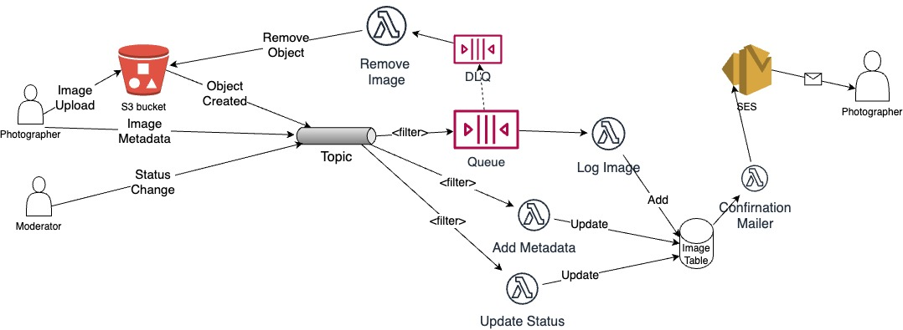

## Distributed Systems - Event-Driven Architecture.

__Name:__ Peter Woods

__Demo__: [YouTube Demo](https://youtu.be/0-XboOIwWuU)

This repository contains the implementation of a skeleton design for an application that manages a photo gallery, illustrated below. The app uses an event-driven architecture and is deployed on the AWS platform using the CDK framework for infrastructure provisioning.

### Code Status.

__Feature:__
+ Photographer:
  + Log new Images - Completed and Tested
  + Metadata updating - Completed and Tested
  + Invalid image removal - Completed and Tested
  + Status Update Mailer - Completed and Tested
+ Moderator:
  + Status updating - Completed and Tested
+ System:
  + SNS Message Filtering - Completed and Tested
  + SQS Dead-Letter Queue handling - Completed and Tested

### Notes

- Moderator review messages were added with a `metadata_type: status` attribute to allow proper SNS filtering, reflecting real-world system design beyond minimum assignment requirements.
- PowerShell AWS CLI commands were used to test Photographer and Moderator interactions.
